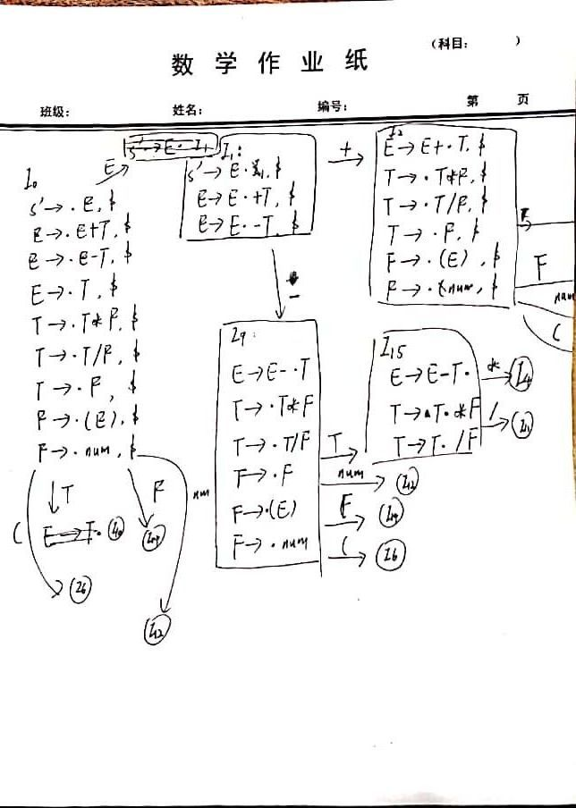
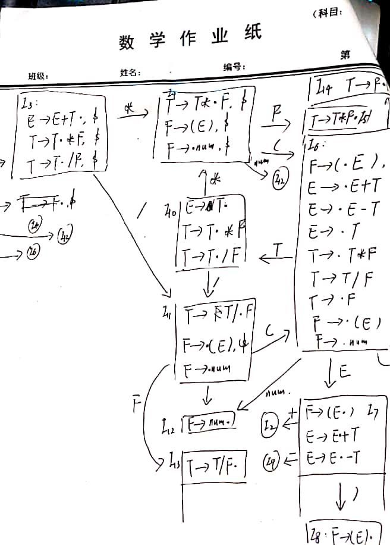

# C语言语法分析程序的设计与实现

> 2018211236 王泽坤

## 概述

### 实验内容及要求
* 编写LL(1)语法分析程序，要求如下。
    1. 编程实现算法4.2，为给定文法自动构造预测分析表。
    2. 编程实现算法4.1，构造LL(1)预测分析程序 。
* 编写语法分析程序实现自底向上的分析，要求如下。
    1. 构造识别该文法所有活前缀的DFA。
    2. 构造该文法的LR分析表。
    3. 编程实现算法4.3，构造LR分析程序。 

### 实验环境

* 操作系统：Linux
* 编程语言：C++

### Feature
* 是用了词法分析时库，支持解析一个文本文件，先进行词法分析，再进行语法分析

## 程序设计说明

### LL语法构造

* 改造语法，要求的语法需要先消左递归，左公因子
  * E -> TA
  * A -> BA | $\epsilon$
  * B -> +T | -T
  
  * T -> FC
  * C -> DC | $\epsilon$
  * D -> *F | /F
  * F -> (E) | num
* `class G` 文法类
  
    ``` c++
    class G {
    public:
    	G(set<Token> V_t, set<char> V_n, char start, vector<pair<char, vector<V>>> P)
    	: V_t(V_t), V_n(V_n), start(start), P(P){};
    
        set<Token> V_t; //终结符
    set<char> V_n;  //非终结符
    
    char start;
    
        vector<pair<char, vector<V>>> P; //产生式
    };
    ```
    
    * 一个set包含文法的所有终结符
    * 一个set包含文法的所有非终结符
* 一个vector包含文法的所有产生式
  
* `map<char, set<Token>> getFirst(G &g)`
  
  输入一个文法，得到这个文法的`FIRST`集，要求文法没有左递归和左公因式
  
* `map<char, set<Token>> getFollow(G &g, map<char, set<Token>> &first)`
  
  输入一个文法和这个文法的`FIRST`集，得到这个文法的`FOLLOW`集，要求文法没有左递归和左公因式
  
* `Table buildTable(G &g, map<char, set<Token>> &first,map<char, set<Token>> &follow)`
  
  输入一个文法和它的`FIRST`和`FOLLOW`集，得到这个文法的预测分析表，实现算法4.2
  
* `bool test(Table &M, char start, vector<Token> const &w)`
  
    * 输入一个文法的预测分析表和起始文法，预测输入的Token流是否合法

### LR语法构造

* 改造语法
  0.  S -> E
  1. E -> E+T
  2. E -> E-T
  3. E -> T
  4. T -> T * F
  5. T -> T / F
  6. T -> F
  7. F -> (E)
  8. F -> num
* 活前缀识别

<center class="half">
 
</center>


* action表

  | +    | -    | *    | /    | (    | )    | num  | $    |
  | ---- | ---- | ---- | ---- | ---- | ---- | ---- | ---- |
  |      |      |      |      | s6   |      | s12  |      |
  | s2   | s9   |      |      |      |      |      | acc  |
  |      |      |      |      | s6   |      | s12  |      |
  | r1   | r1   | s4   | s11  |      | r1   |      | r1   |
  |      |      |      |      | s6   |      | s12  |      |
  | s2   | s9   |      |      |      | s8   |      |      |
  | r7   | r7   | r7   | r7   |      | r7   |      | r7   |
  |      |      |      |      | s6   |      | s12  |      |
  | r3   | r3   |      |      |      | r3   |      | r3   |
  |      |      |      |      | s6   |      | s12  |      |
  | r8   | r8   | r8   | r8   |      | r8   |      | r8   |
  | r5   | r5   | r5   | r5   |      | r5   |      | r5   |
  | r6   | r6   | r6   | r6   |      | r6   |      | r6   |
  | r2   | r2   | s4   | s11  |      | r2   |      | r2   |

* goto 表

  | E    | T    | F    |
  | ---- | ---- | ---- |
  | 1    | 10   | 14   |
  |      |      |      |
  |      | 3    | 14   |
  |      |      |      |
  |      |      | 5    |
  |      |      |      |
  | 7    | 10   | 14   |
  |      |      |      |
  |      |      |      |
  |      | 15   | 14   |
  |      |      |      |
  |      |      | 13   |
  |      |      |      |
  |      |      |      |
  |      |      |      |
  |      |      |      |

  

*  `class LR`
    ``` c++
    class LR {
    public:
        map<pair<unsigned, Token>, Action> action;
        map<pair<unsigned, char>, unsigned> goto_;
        vector<pair<char, vector<V>>> P; //产生式

        bool test(vector<Token> const &w);
    };
    ```
    * 一个map表示action表
    * 一个map表示goto表
    * 一个vector包含文法的产生式

*  `bool test(vector<Token> const &w)`
   
    * 输入一个文法，预测输入的Token流是否合法

## 测试程序

### 测试1
* 源代码
``` c
(1 + 3 + 4 + 2 + 1) / (2 + 3)
```

* 输出
```
tokens: (,<num>,+,<num>,+,<num>,+,<num>,+,<num>,),/,(,<num>,+,<num>,)
LL(1)文法：
E->TA   A T
T->FC   A C F
F->(E)  A C ) E (
E->TA   A C ) A T
T->FC   A C ) A C F
F-><num>        A C ) A C <num>
C->ε    A C ) A
A->BA   A C ) A B
B->+T   A C ) A T +
T->FC   A C ) A C F
F-><num>        A C ) A C <num>
C->ε    A C ) A
A->BA   A C ) A B
B->+T   A C ) A T +
T->FC   A C ) A C F
F-><num>        A C ) A C <num>
C->ε    A C ) A
A->BA   A C ) A B
B->+T   A C ) A T +
T->FC   A C ) A C F
F-><num>        A C ) A C <num>
C->ε    A C ) A
A->BA   A C ) A B
B->+T   A C ) A T +
T->FC   A C ) A C F
F-><num>        A C ) A C <num>
C->ε    A C ) A
A->ε    A C )
C->DC   A C D
D->/F   A C F /
F->(E)  A C ) E (
E->TA   A C ) A T
T->FC   A C ) A C F
F-><num>        A C ) A C <num>
C->ε    A C ) A
A->BA   A C ) A B
B->+T   A C ) A T +
T->FC   A C ) A C F
F-><num>        A C ) A C <num>
C->ε    A C ) A
A->ε    A C )
C->ε    A
A->ε
识别成功

SLR(1)文法：
[移进](
[移进]<num>
[规约]F-><num>
[规约]T->F
[规约]E->T
[移进]+
[移进]<num>
[规约]F-><num>
[规约]T->F
[规约]E->E+T
[移进]+
[移进]<num>
[规约]F-><num>
[规约]T->F
[规约]E->E+T
[移进]+
[移进]<num>
[规约]F-><num>
[规约]T->F
[规约]E->E+T
[移进]+
[移进]<num>
[规约]F-><num>
[规约]T->F
[规约]E->E+T
[移进])
[规约]F->(E)
[规约]T->F
[移进]/
[移进](
[移进]<num>
[规约]F-><num>
[规约]T->F
[规约]E->T
[移进]+
[移进]<num>
[规约]F-><num>
[规约]T->F
[规约]E->E+T
[移进])
[规约]F->(E)
[规约]T->F
[规约]E->T
识别成功
```

### 测试2
* 源代码

``` c
(1+2) * (3+4) / (4-3) + (5+6)
```


* 输出
```
tokens: (,<num>,+,<num>,),*,(,<num>,+,<num>,),/,(,<num>,-,<num>,),+,(,<num>,+,<num>,)
LL(1)文法：
E->TA   A T
T->FC   A C F
F->(E)  A C ) E (
E->TA   A C ) A T
T->FC   A C ) A C F
F-><num>        A C ) A C <num>
C->ε    A C ) A
A->BA   A C ) A B
B->+T   A C ) A T +
T->FC   A C ) A C F
F-><num>        A C ) A C <num>
C->ε    A C ) A
A->ε    A C )
C->DC   A C D
D->*F   A C F *
F->(E)  A C ) E (
E->TA   A C ) A T
T->FC   A C ) A C F
F-><num>        A C ) A C <num>
C->ε    A C ) A
A->BA   A C ) A B
B->+T   A C ) A T +
T->FC   A C ) A C F
F-><num>        A C ) A C <num>
C->ε    A C ) A
A->ε    A C )
C->DC   A C D
D->/F   A C F /
F->(E)  A C ) E (
E->TA   A C ) A T
T->FC   A C ) A C F
F-><num>        A C ) A C <num>
C->ε    A C ) A
A->BA   A C ) A B
B->-T   A C ) A T -
T->FC   A C ) A C F
F-><num>        A C ) A C <num>
C->ε    A C ) A
A->ε    A C )
C->ε    A
A->BA   A B
B->+T   A T +
T->FC   A C F
F->(E)  A C ) E (
E->TA   A C ) A T
T->FC   A C ) A C F
F-><num>        A C ) A C <num>
C->ε    A C ) A
A->BA   A C ) A B
B->+T   A C ) A T +
T->FC   A C ) A C F
F-><num>        A C ) A C <num>
C->ε    A C ) A
A->ε    A C )
C->ε    A
A->ε
识别成功

SLR(1)文法：
[移进](
[移进]<num>
[规约]F-><num>
[规约]T->F
[规约]E->T
[移进]+
[移进]<num>
[规约]F-><num>
[规约]T->F
[规约]E->E+T
[移进])
[规约]F->(E)
[规约]T->F
[移进]*
[移进](
[移进]<num>
[规约]F-><num>
[规约]T->F
[规约]E->T
[移进]+
[移进]<num>
[规约]F-><num>
[规约]T->F
[规约]E->E+T
[移进])
[规约]F->(E)
[规约]T->F
[移进]/
[移进](
[移进]<num>
[规约]F-><num>
[规约]T->F
[规约]E->T
[移进]-
[移进]<num>
[规约]F-><num>
[规约]T->F
[规约]E->E-T
[移进])
[规约]F->(E)
[规约]T->F
[规约]E->T
[移进]+
[移进](
[移进]<num>
[规约]F-><num>
[规约]T->F
[规约]E->T
[移进]+
[移进]<num>
[规约]F-><num>
[规约]T->F
[规约]E->E+T
[移进])
[规约]F->(E)
[规约]T->F
[规约]E->E+T
识别成功
```

### 测试3
* 源代码
``` c
1 + 1+1+1+1+1/1/1/1/1/1/1/1/1/1/1/1/11/1/1/1
```

* 输出结果
```

tokens: <num>,+,<num>,+,<num>,+,<num>,+,<num>,+,<num>,/,<num>,/,<num>,/,<num>,/,<num>,/,<num>,/,<num>,/,<num>,/,<num>,/,<num>,/,<num>,/,<num>,/,<num>,/,<num>,/,<num>,/,<num>
LL(1)文法：
E->TA   A T
T->FC   A C F
F-><num>        A C <num>
C->ε    A
A->BA   A B
B->+T   A T +
T->FC   A C F
F-><num>        A C <num>
C->ε    A
A->BA   A B
B->+T   A T +
T->FC   A C F
F-><num>        A C <num>
C->ε    A
A->BA   A B
B->+T   A T +
T->FC   A C F
F-><num>        A C <num>
C->ε    A
A->BA   A B
B->+T   A T +
T->FC   A C F
F-><num>        A C <num>
C->ε    A
A->BA   A B
B->+T   A T +
T->FC   A C F
F-><num>        A C <num>
C->DC   A C D
D->/F   A C F /
F-><num>        A C <num>
C->DC   A C D
D->/F   A C F /
F-><num>        A C <num>
C->DC   A C D
D->/F   A C F /
F-><num>        A C <num>
C->DC   A C D
D->/F   A C F /
F-><num>        A C <num>
C->DC   A C D
D->/F   A C F /
F-><num>        A C <num>
C->DC   A C D
D->/F   A C F /
F-><num>        A C <num>
C->DC   A C D
D->/F   A C F /
F-><num>        A C <num>
C->DC   A C D
D->/F   A C F /
F-><num>        A C <num>
C->DC   A C D
D->/F   A C F /
F-><num>        A C <num>
C->DC   A C D
D->/F   A C F /
F-><num>        A C <num>
C->DC   A C D
D->/F   A C F /
F-><num>        A C <num>
C->DC   A C D
D->/F   A C F /
F-><num>        A C <num>
C->DC   A C D
D->/F   A C F /
F-><num>        A C <num>
C->DC   A C D
D->/F   A C F /
F-><num>        A C <num>
C->DC   A C D
D->/F   A C F /
F-><num>        A C <num>
C->ε    A
A->ε
识别成功

SLR(1)文法：
[移进]<num>
[规约]F-><num>
[规约]T->F
[规约]E->T
[移进]+
[移进]<num>
[规约]F-><num>
[规约]T->F
[规约]E->E+T
[移进]+
[移进]<num>
[规约]F-><num>
[规约]T->F
[规约]E->E+T
[移进]+
[移进]<num>
[规约]F-><num>
[规约]T->F
[规约]E->E+T
[移进]+
[移进]<num>
[规约]F-><num>
[规约]T->F
[规约]E->E+T
[移进]+
[移进]<num>
[规约]F-><num>
[规约]T->F
[移进]/
[移进]<num>
[规约]F-><num>
[规约]T->T/F
[移进]/
[移进]<num>
[规约]F-><num>
[规约]T->T/F
[移进]/
[移进]<num>
[规约]F-><num>
[规约]T->T/F
[移进]/
[移进]<num>
[规约]F-><num>
[规约]T->T/F
[移进]/
[移进]<num>
[规约]F-><num>
[规约]T->T/F
[移进]/
[移进]<num>
[规约]F-><num>
[规约]T->T/F
[移进]/
[移进]<num>
[规约]F-><num>
[规约]T->T/F
[移进]/
[移进]<num>
[规约]F-><num>
[规约]T->T/F
[移进]/
[移进]<num>
[规约]F-><num>
[规约]T->T/F
[移进]/
[移进]<num>
[规约]F-><num>
[规约]T->T/F
[移进]/
[移进]<num>
[规约]F-><num>
[规约]T->T/F
[移进]/
[移进]<num>
[规约]F-><num>
[规约]T->T/F
[移进]/
[移进]<num>
[规约]F-><num>
[规约]T->T/F
[移进]/
[移进]<num>
[规约]F-><num>
[规约]T->T/F
[移进]/
[移进]<num>
[规约]F-><num>
[规约]T->T/F
[规约]E->E+T
识别成功
```